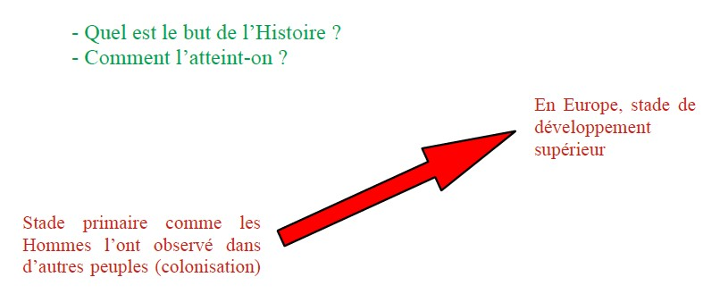
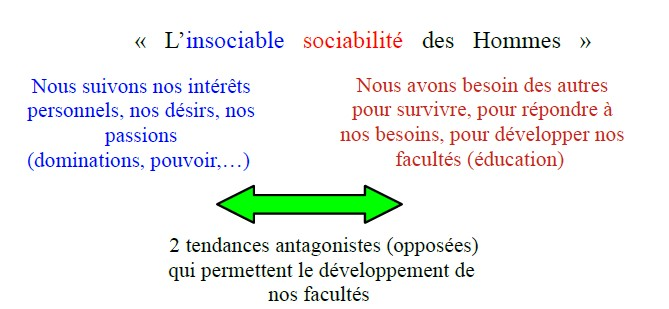
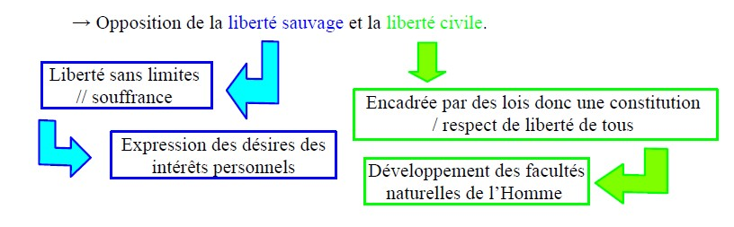

<meta chartes="utf-8" />
<html>
 <head>
 <meta name="viewport" content="width=device-width, initial-scale=1">
 
 </head>

 <body>
 <h1 id="para1">Emmanuel KANT, <i><u>IDÉE D’UNE HISTOIRE UNIVERSELLE AU POINT DE VUE COSMOPOLITIQUE,</u></i>  1784</h1>
    

 
 &nbsp;&nbsp; &nbsp;&nbsp; Dans cet essai philosophique, Emmanuel KANT vise à montrer que l’Histoire a un sens, c’est-à-dire que le cours des évènements humains ne se déroule pas simplement au hasard. 

  
 

  
 
 &nbsp;&nbsp; &nbsp;&nbsp;Pour KANT, le hasard n’est qu’apparent. En réalité, nos actions sont déterminées par la Nature qui s’organise selon des lois universelles.

 
≠Liberté

 
 &nbsp;&nbsp; &nbsp;&nbsp;Ainsi, ce qui semble désordonné et irrationnel dans l’Histoire du point de vue de l’individu, se révèle du point de vue de l’espèce humaine comme un « développement progressif et continu de ses disposition originelles ». 

 

  
<b>INTRODUCTION </b>

   
  
&nbsp;&nbsp; &nbsp;&nbsp; → KANT propose de chercher s’il n’existe pas un « dessein de la Nature », c’est-à-dire un but de la Nature qui suivent des règles. Il envisage que derrière les actions humaines passionnelles, intéressées, chaotiques, irrationnelles, il existe un ordre rationnel.
  &nbsp;&nbsp; &nbsp;&nbsp; └> Cela pose la question du déterminisme dans les actions humaines.
   

 

  
<b>PREMIÈRE PROPOSITION </b>

   
  
&nbsp;&nbsp; &nbsp;&nbsp;- Références à ARISTOTE :
   &nbsp;&nbsp; &nbsp;&nbsp;&nbsp;&nbsp; &nbsp;&nbsp;1- en puissance / en acte
   &nbsp;&nbsp; &nbsp;&nbsp;&nbsp;&nbsp; &nbsp;&nbsp;2- La téléologie ( τέλος, en grec téléos : but)
   &nbsp;&nbsp; &nbsp;&nbsp;&nbsp;&nbsp; &nbsp;&nbsp;&nbsp;&nbsp; &nbsp;&nbsp;&nbsp;&nbsp; &nbsp;&nbsp;&nbsp;&nbsp; &nbsp;&nbsp;&nbsp;&nbsp; &nbsp;&nbsp; &nbsp;&nbsp;&nbsp;&nbsp; &nbsp;&nbsp;« La nature ne fait rien en vain » (ARISTOTE) 
   
   &nbsp;&nbsp; &nbsp;&nbsp;Pour ARISTOTE, la Nature suit une finalité.
   &nbsp;&nbsp; &nbsp;&nbsp;&nbsp;&nbsp; &nbsp;&nbsp;Ex : un organe est naturellement voué à une fonction.
   &nbsp;&nbsp; &nbsp;&nbsp;└> Les productions naturelles ne sont pas des échecs, mais que chacune à sa place.
  

    

  
<b>DEUXIÈME PROPOSITION </b>

   
  
&nbsp;&nbsp; &nbsp;&nbsp; → La Nature a doté l’Homme d’une rationalité qui lui sert à développer toutes ses facultés (technologiques, intellectuelles, artistiques, etc.)
   &nbsp;&nbsp; &nbsp;&nbsp; Ce développement des facultés se réalise dans le cadre de l’espace humaine.
   La vie d’un seul individu n’est pas suffisante lorsque pour le rendre possible. └> L’Homme peut devenir plus que ce qu’il est.

  
&nbsp;&nbsp; &nbsp;&nbsp; &nbsp;&nbsp; &nbsp;&nbsp;  = La perfectibilité de l’Homme (J.J. ROUSSEAU)

  
&nbsp;&nbsp; &nbsp;&nbsp;Car, il n’est pas enfermé dans les limites de son instinct, contrairement à l’animal.
   &nbsp;&nbsp; &nbsp;&nbsp;L’Homme est capable de faire des projets qu’il se propose lui-même, il est donc libre.

  
<b><u>Progrès </u></b>: peut être continu ou non-continu et croissant ou décroissant. Ce n’est doncpas une amélioration continue.
   &nbsp;&nbsp; &nbsp;&nbsp; &nbsp;&nbsp; &nbsp;&nbsp; Une maladie qui progresse donc pas d’amélioration.

  
&nbsp;&nbsp; &nbsp;&nbsp;   La raison dont est doté l’Homme par la Nature permet le progrès de l’humanité, c’est-à-dire de l’espèce humaine, par « essais », « exercices »,« enseignements » : accumulation des savoirs et des savoir-faire.
   &nbsp;&nbsp; &nbsp;&nbsp;L’existence de l’individu est trop courte pour permettre cette évolution qui a donc lieu au sein de l’espèce.

  
&nbsp;&nbsp; &nbsp;&nbsp; &nbsp;&nbsp; &nbsp;&nbsp;⧓ Cette évolution est évaluée pour la réalisation du dessein de la Nature.
   &nbsp;&nbsp; &nbsp;&nbsp; &nbsp;&nbsp; &nbsp; ⧓ Cette évolution est évaluée par la Nature.

      

  
<b>TROISIÈME PROPOSITION </b>

   
  
&nbsp;&nbsp; &nbsp;&nbsp;  → L’Homme, même s’il est également un animal, il n’a pas d’instinct, mais il possède une raison. Celle-ci permet à l’Homme de dépasser les obstacles auxquels il est confronté, de progresser ; ainsi, il doit ce qu’il invente ou ce qu’il fait à lui-même.
   &nbsp;&nbsp; &nbsp;&nbsp;  &nbsp;&nbsp; &nbsp;&nbsp;  &nbsp;&nbsp; &nbsp;&nbsp;  └> estime de soi ≠ l’orgueil 

 
&nbsp;&nbsp; &nbsp;&nbsp; &nbsp;&nbsp; &nbsp;&nbsp;  -Référence à ARISTOTE : « sur la main » / « intelligence »
  &nbsp;&nbsp; &nbsp;&nbsp; &nbsp;&nbsp; &nbsp;&nbsp;&nbsp;-Référence à PLATON : le mythe de PROMÉTHÉE (les animaux sont dotés
par la Nature de tout ce dont ils ont besoin pour la survive de l’espèce)

 
&nbsp;&nbsp; &nbsp;&nbsp;  → Le travail de chaque génération permet à la suivante de mieux vivre.

      

  
<b>QUATRIÈME PROPOSITION </b>

   
  
&nbsp;&nbsp; &nbsp;&nbsp;   → La Nature utilise les oppositions (les désaccords, les guerres, les conflits, …) entre les Hommes pour atteindre son objectif qui est le développement complet des facultés humaines.
    &nbsp;&nbsp; &nbsp;&nbsp;Ces oppositions seront résolues grâce à l’établissement des lois.

   
   
   
     

    
   
&nbsp;&nbsp; &nbsp;&nbsp;    → Ces deux tendances en tension visent à établir une morale par les lois. Ces deux tendances nécessitent un cadre afin de les canaliser, ce seront les lois établies par la société. Ainsi le progrès généré par cette double tension (concurrences, vivalité, entraide,…) va pouvoir mener au progrès moral, par l’intermédiaire des lois.
     &nbsp;&nbsp; &nbsp;&nbsp; → Comparaison avec l’Arcadie afin de souligner la nécessité des conflits, des guerres pour le progrès.
     &nbsp;&nbsp; &nbsp;&nbsp;  Arcadie : lieu idéal imaginaire appelé l’Âge d’or, en Grèce Antique :
    - Repris par Virgile (Les Bucoliques), Ovide (Les Métamorphoses) dans leurs ouvrages.
    -Vie harmonieuse entre les Hommes et la nature à la disposition des Hommes
    &nbsp;&nbsp; &nbsp;&nbsp; └> État de paix, donc pas de vivalité nie de concurrence dons pas de progrès.
     De cette tendance conflictuelle des Homme on peut déduire que quelque choses agit à travers les actions des hommes pour réaliser le progrès moral, but ultime de la Nature.

    

  
<b>CINQIÈME PROPOSITION </b>

   
   

  
&nbsp;&nbsp; &nbsp;&nbsp; → Pour cadrer cette liberté sauvage, il faut fonder une société civile qui va établir des lois  justes.
    Justice: chaque citoyen sera aussi libre que les autres et suivra les mêmes contraintes légales.
    &nbsp;&nbsp; &nbsp;&nbsp;→Métaphore des arbres dans la forêt: les arbres sont en concurrence les uns avec les autres, pour atteindre le soleil. ≠ Quand il y a peu d’arbres, ils sont en totale liberté et poussent dans tous les sens, pas droit.

      

  
<b>SIXIÈME PROPOSITION </b>

   
  
&nbsp;&nbsp; &nbsp;&nbsp;   → L’Homme est un animale: il suit ses désirs, ses intérêts
   &nbsp;&nbsp; &nbsp;&nbsp;→ C’est pour cela qu’il a besoin d’un maître qui va établir des lois pour que la société soit possible
   &nbsp;&nbsp; &nbsp;&nbsp;→ PROBLÈME: le maître est aussi un être humain qui suit ses désirs.
   &nbsp;&nbsp; &nbsp;&nbsp;&nbsp;&nbsp; &nbsp;&nbsp;Il faudrait que ce maître soit juste, droit, sans avoir besoin de lois pour le cadrer. => IMPOSSIBLE
  
«Dans un bois aussi courbe que celui dont est fait l’Homme, on ne peut rien tailler de tout à fait droit»  

   
  
&nbsp;&nbsp; &nbsp;&nbsp;    → Nécessité d’établir une constitution:
   &nbsp;&nbsp; &nbsp;&nbsp;  &nbsp;&nbsp; &nbsp;&nbsp;  MAIS comment faire pour qu’elle soit plus juste possible?

 <ol>
     <li id="para3"> &nbsp;&nbsp; &nbsp;&nbsp; Il faut une philosophie du droit (savoir définir la justice et le droit)</li>
     <li id="para3">&nbsp;&nbsp; &nbsp;&nbsp; Il faut voyager pour prendre connaissance des constitutions existants ailleurs et conserver ce qu’il y a de meilleur dans chacune d’elles pour constituer la nôtre</li>
     <li id="para3"> &nbsp;&nbsp; &nbsp;&nbsp; Il faut éduquer le peuple pour qu’il soit prêt à accepter une constitution (= des contraintes à sa liberté) que l’on lui impose => Pédagogie</li>
 </ol>

      

  
<b>SEPTIÈME PROPOSITION </b>

   
  
&nbsp;&nbsp; &nbsp;&nbsp;  → On retrouve l’« insociable sociabilité » au coeur des États : chaque État cherche à satisfaire ses intérêts personnels. Donc on a besoin de lois internationales pour garantir la prospérité et la paix de chacun.

      

  
<b>HUITIÈME PROPOSITION </b>

   
  
&nbsp;&nbsp; &nbsp;&nbsp;<mark> "Millénarisme"</mark>: une forme de croyance eschatologique qui promet l'avènement d'une ère radicalement nouvelle qui mettra fin aux souffrances que nous connaissons.
    &nbsp;&nbsp; &nbsp;&nbsp;  → Il suppose la possibilité de connaître l'avenir, qui sera fait de bonheur et de liberté.
    &nbsp;&nbsp; &nbsp;&nbsp;   → Emmanuel KANT imagine un État libéral où règne le plus de liberté possible dans les limites des lois (morales / justes). Il prône la liberté religieuse. 
   &nbsp;&nbsp; &nbsp;&nbsp; &nbsp;&nbsp; &nbsp;&nbsp;   
  C'est la réalisation des Lumières. 
    &nbsp;&nbsp; &nbsp;&nbsp;  → Emmanuel KANT note aussi que l’indépendance des États, des personnes n'ont pas intérêt à entrer en conflit. 
   &nbsp;&nbsp; &nbsp;&nbsp;&nbsp;&nbsp; &nbsp;&nbsp;    C'est pourquoi chaque État, dans sa concurrence avec les autres, doit veiller au développement des sciences et des technologies. Ainsi, il contribue au progrès de l'humanité.
   &nbsp;&nbsp; &nbsp;&nbsp;   → Ce progrès de l’humanité signifie le développement des facultés humaines et de la moralité.

      

  
<b>NEUVIÈME PROPOSITION </b>

   
  
&nbsp;&nbsp; &nbsp;&nbsp; → Emmanuel KANT envisage l’histoire au point de vue cosmopolitique et  expose le plan général d’une histoire universelle de l’humanité comme progrès , des Grecs jusqu’au XVIIIe siècle.
   &nbsp;&nbsp; &nbsp;&nbsp; → Il pose la nécessité d’une histoire philosophique qui découvre un dessein de la nature dans les actions humaines, qui contribuent à la réalisation de ce dessein.
   &nbsp;&nbsp; &nbsp;&nbsp; → À travers notre histoire, la fin (=le but) de la nature est notre destination  pratique, c’est-à-dire la fin que notre devoir (obligation morale) nous dicte.
   
 &nbsp;&nbsp; &nbsp;&nbsp; &nbsp;&nbsp; &nbsp;&nbsp; Étymologie grecque du mot « histoire » :
  &nbsp;&nbsp; &nbsp;&nbsp; &nbsp;&nbsp; &nbsp;&nbsp; &nbsp;&nbsp; &nbsp;&nbsp;  « ίστορία » (istoria) : signifie « enquête »
   &nbsp;&nbsp; &nbsp;&nbsp; &nbsp;&nbsp; &nbsp;&nbsp; └> HÉRODOTE, THUCYDIDE (historiens)
   &nbsp;&nbsp; &nbsp;&nbsp; → Importance d’une histoire philosophique qui permettrait de prévoir l’avenir.
   &nbsp;&nbsp; &nbsp;&nbsp; →<b><mark> La morale</mark></b> : ce qui compte ce sera la valeur de nos actions et de leurs conséquences.
   &nbsp;&nbsp; &nbsp;&nbsp; → Cette téléologie de l’histoire s’adresse essentiellement aux historiens futurs, car il est nécessaire que chaque citoyen connaisse le passé pour suivre le dessein de la nature dans l’histoire et qu’il agisse en conséquence.
   &nbsp;&nbsp; &nbsp;&nbsp; → L’histoire est la mémoire des peuples libres, tandis que l’oubli fait l’esclavage et la barbarie.

    
 

FINE

    

  

  
 Veuillez trouver la version PDF de ce cours ci-dessous  😇 

   
   <a href="image/Emmanuel_KANT-Idée d_une histoire universelle au point de vue cosmopolitique-1784.pdf" dowload="">
Cliquer ici pour télécharger!
</a>
     
  <embed type="application/pdf" src="image\Emmanuel_KANT-Idée d_une histoire universelle au point de vue cosmopolitique-1784.pdf" width="1000" height="1500" />
 
 
 
 
 
 
 
 
 
 
 
 
 
  
 
 
 
 
  </body>
 